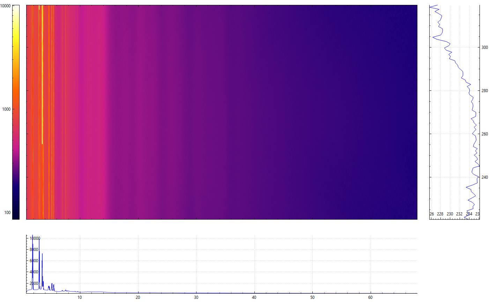
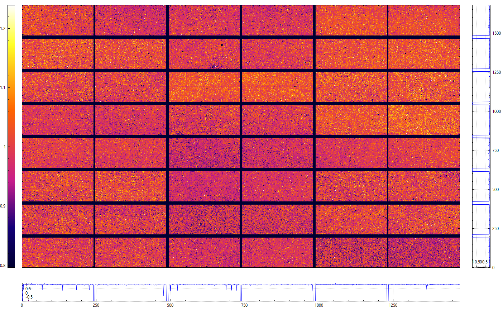

A rewrite of the Python multi position total-scattering processing library (https://github.com/msujas/multipositionpdf) in Rust.

Includes library and executables for integrating data and calculating flat-fields. There is also a Python implementation (https://github.com/msujas/multipos_rustpy) which would allow the Rust library to run in a Python script.

Maybe most convenient to run in a batch/shell script. E.g. for multiple subdirs (Windows .bat)

```bat
set "ponidir=<path to poni dir>"
echo %ponidir%
for %%s in ("sample1" "sample2")(
    echo %%s
    multiposintegrator<.lnk> --tthmin 0.75 --tthmax 68 --tthbins 5000 --chimin 220 --chimax 320 ^
    --chibins 101 --pfactor 0.85 --ponidir %ponidir% --cbfdir %ponidir%/%%s ^
    --maskfile <path to mask file> --ponipattern *MD.poni
)
```

in .sh

```bash
PONIDIR="<path to poni directory>"
declare -a subdirs=("sample1" "sample2")
echo $PONIDIR
for s in "${subdirs[@]}"
do
    echo "$s"
    multiposintegrator --tthmin 0.75 --tthmax 68 --tthbins 5000 --chimin 220 --chimax 320 \
    --chibins 101 --pfactor 0.85 --ponidir "$PONIDIR" --cbfdir "$PONIDIR/$s" \
    --maskfile <path to mask file>  --ponipattern *MD.poni
done
```

Snippet for iterating over all directories in a path

```bat
for /D %%s in ("<dirname>/*") do (
    ...
)
```
```bash
for s in <dirname>/*/
do
    ...
done
```

Integrated and merged cake of C60


Calculated flat field from 55 images of X-ray scattering from a glass rod
